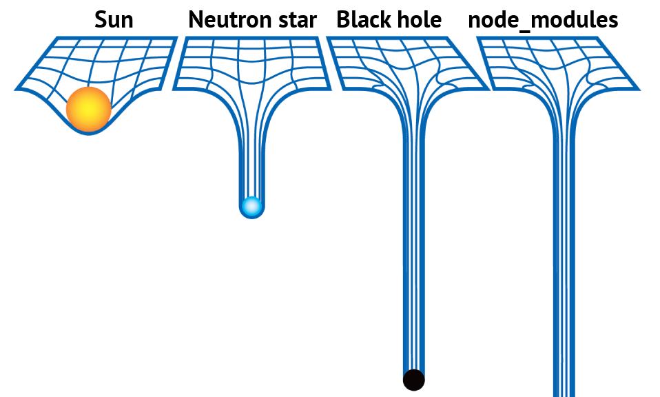

+++
title = "Node.js の環境を DevContainer に封じ込めよう"
date = 2025-12-10
# updated =
description = "もはやマルウェア配布プラットフォーム"
[taxonomies]
categories = ["Dev"]
tags = ["docker", "web", "nodejs"]
[extra]
lang = "ja"
toc = true
math = true
mermaid = true
+++

> この記事は [mstdn.maud.io Advent Calendar 2025](https://adventar.org/calendars/11516) 10日目の記事です．

11月24日 `postman` や `zapier` など 500 以上のパッケージがサプライチェーン攻撃を受けていたことが報告されました．

[Shai Hulud Strikes Again (v2) - Socket](https://socket.dev/blog/shai-hulud-strikes-again-v2)

<blockquote class="twitter-tweet" data-media-max-width="560"><p lang="ja" dir="ltr">postmanやzapierが攻撃されていた。bunをインストールして悪意のあるスクリプトが動くっぽい / Shai Hulud Strikes Again (v2) - Socket <a href="https://t.co/q0xsBHYyhh">https://t.co/q0xsBHYyhh</a></p>&mdash; hiroppy (@about_hiroppy) <a href="https://twitter.com/about_hiroppy/status/1992933867700007274?ref_src=twsrc%5Etfw">November 24, 2025</a></blockquote> <script async src="https://platform.twitter.com/widgets.js" charset="utf-8"></script>

この Shai Hulud というサプライチェーン攻撃は実は9月にも同様に発生しており， `@ctrl/tinycolor` パッケージなども同様の手口によって攻撃を受けました．

[毎週200万回以上ダウンロードされる人気の@ctrl/tinycolorパッケージが高度なサプライチェーン攻撃「Shai-Hulud」によって40以上のNPMパッケージとともに侵害を受けていると発覚 - GIGAZINE](https://gigazine.net/news/20250917-shai-hulud-npm-packages/)

みなさん驚きなんと今年2回目！w

# なんとかならんのか?

Node.js のエコシステムは非常に大きいもので，全世界に数百万のパッケージが存在している上に，それらのパッケージは全世界のプロダクトに利用されています．

私個人としては Node.js のエコシステムに関しては **呆れ** と **諦念** の感情が強く，この脆弱なシステムはもはやどうしようもないと思っています．

(というかどうにかなってたら恐らく Deno は産まれてないし[^1]，こんなサプライチェーン攻撃が頻繁には行われないでしょう)

<iframe width="560" height="315" src="https://www.youtube.com/embed/swXWUfufu2w?si=fWOG9rZxCL4o18gB&amp;start=61" title="YouTube video player" frameborder="0" allow="accelerometer; autoplay; clipboard-write; encrypted-media; gyroscope; picture-in-picture; web-share" referrerpolicy="strict-origin-when-cross-origin" allowfullscreen></iframe>

# DevContainer のすゝめ

エコシステムが脆弱なら，ローカルを最後の砦として守るしかありません．

私が最近使っているのは DevContainer です．つい最近も PHP をローカルから追い出して気持ちよくなってました[^2]．

<blockquote class="mastodon-embed" data-embed-url="https://mstdn.maud.io/@m1sk9/115613453651083916/embed" style="background: #FCF8FF; border-radius: 8px; border: 1px solid #C9C4DA; margin: 0; max-width: 540px; min-width: 270px; overflow: hidden; padding: 0;"> <a href="https://mstdn.maud.io/@m1sk9/115613453651083916" target="_blank" style="align-items: center; color: #1C1A25; display: flex; flex-direction: column; font-family: system-ui, -apple-system, BlinkMacSystemFont, 'Segoe UI', Oxygen, Ubuntu, Cantarell, 'Fira Sans', 'Droid Sans', 'Helvetica Neue', Roboto, sans-serif; font-size: 14px; justify-content: center; letter-spacing: 0.25px; line-height: 20px; padding: 24px; text-decoration: none;"> <svg xmlns="http://www.w3.org/2000/svg" xmlns:xlink="http://www.w3.org/1999/xlink" width="32" height="32" viewBox="0 0 79 75"><path d="M63 45.3v-20c0-4.1-1-7.3-3.2-9.7-2.1-2.4-5-3.7-8.5-3.7-4.1 0-7.2 1.6-9.3 4.7l-2 3.3-2-3.3c-2-3.1-5.1-4.7-9.2-4.7-3.5 0-6.4 1.3-8.6 3.7-2.1 2.4-3.1 5.6-3.1 9.7v20h8V25.9c0-4.1 1.7-6.2 5.2-6.2 3.8 0 5.8 2.5 5.8 7.4V37.7H44V27.1c0-4.9 1.9-7.4 5.8-7.4 3.5 0 5.2 2.1 5.2 6.2V45.3h8ZM74.7 16.6c.6 6 .1 15.7.1 17.3 0 .5-.1 4.8-.1 5.3-.7 11.5-8 16-15.6 17.5-.1 0-.2 0-.3 0-4.9 1-10 1.2-14.9 1.4-1.2 0-2.4 0-3.6 0-4.8 0-9.7-.6-14.4-1.7-.1 0-.1 0-.1 0s-.1 0-.1 0 0 .1 0 .1 0 0 0 0c.1 1.6.4 3.1 1 4.5.6 1.7 2.9 5.7 11.4 5.7 5 0 9.9-.6 14.8-1.7 0 0 0 0 0 0 .1 0 .1 0 .1 0 0 .1 0 .1 0 .1.1 0 .1 0 .1.1v5.6s0 .1-.1.1c0 0 0 0 0 .1-1.6 1.1-3.7 1.7-5.6 2.3-.8.3-1.6.5-2.4.7-7.5 1.7-15.4 1.3-22.7-1.2-6.8-2.4-13.8-8.2-15.5-15.2-.9-3.8-1.6-7.6-1.9-11.5-.6-5.8-.6-11.7-.8-17.5C3.9 24.5 4 20 4.9 16 6.7 7.9 14.1 2.2 22.3 1c1.4-.2 4.1-1 16.5-1h.1C51.4 0 56.7.8 58.1 1c8.4 1.2 15.5 7.5 16.6 15.6Z" fill="currentColor"/></svg> <div style="color: #787588; margin-top: 16px;">Post by @m1sk9@mstdn.maud.io</div> <div style="font-weight: 500;">View on Mastodon</div> </a> </blockquote> <script data-allowed-prefixes="https://mstdn.maud.io/" async src="https://mstdn.maud.io/embed.js"></script>

## DevContainer に求められること

### 1. Node.js のバージョン管理ができる

Node.js のバージョン管理には mise や asdf などの外部ツールを使うのが一般的ですが，DevContainer の場合は，それらは[単一の Docker Image](https://hub.docker.com/_/node) なのでバージョン管理が簡単です． (Renovate にも更新をさせることができる)

### 2. 全ての開発環境を Docker Container 内で完結できる

DevContainer は起動した Docker Container に VSCode で接続する仕組みなので， DB などそれ以外の環境を DevContainer に含めれれば，ローカルに何もインストールせずに開発が完結します．

### 3. ローカルに影響を与えない

**何と言ってもこれ．**

基本ローカルはクリーンにしておきたいので，DevContainer 内に全ての開発環境を閉じ込めれば，ローカルに影響を与えずに済みます．

## 最小構成で DevContainer を作ってみる

DevContainer を作るにはプロジェクトルートに `.devcontainer` ディレクトリを作成し，その中に `devcontainer.json` を作成します．これが DevContainer の設定ファイルになります．

```json
{
  "name": "Node.js 24.11.1 DevContainer",
  "build": {
    "dockerfile": "Dockerfile"
  },
  "customizations": {
    "vscode": {
      "extensions": [
        "dbaeumer.vscode-eslint",
        "esbenp.prettier-vscode"
      ]
    }
  }
}
```

DevContainer に接続する VSCode は Standalone [^3] となるので，`customizations` フィールドで接続先の VSCode で使いたい拡張機能をインストールしたり，設定を追加したりできます．つまり**開発環境を他のメンバーと共有でき，なおかつ完全分離ができるわけです**．

次に `Dockerfile` を作成します．この `Dockerfile` で作成する Docker Image を実際にコンテナ内で使うことになります．

```dockerfile
FROM node:24.11.1

# 必要なら追加のツールをここでインストールすることもできる
# RUN apt-get update && apt-get install -y ...
```

これで Node.js v24.11.1 を使う DevContainer の完成です．
起動するには VSCode のコマンドパレットから "Dev Containers: Reopen in Container" を実行します．


<div style="text-align: center; font-size: 0.80em; color: #888; margin-top: 8px;">
    イメージの更新や設定変更をしたら "Rebuild and Reopen in Container" を実行しよう
</div>

すると Docker Image のビルド， DevContainer のインストールが行われ，VSCode がコンテナに接続します．


<div style="text-align: center; font-size: 0.80em; color: #888; margin-top: 8px;">
    パッと見は SSH Remote と同じ
</div>

試しに以下のような静的テキストを返す簡易 HTTP サーバーを作成してみます．

```js
import http from 'http';

const server = http.createServer((req, res) => {
    res.writeHead(200, {'content-type': 'text/plain; charset=utf-8'});
    res.end('Hello, World!\n');
})

const PORT = 3000;
server.listen(PORT, () => {
    console.log(`Server is running at http://localhost:${PORT}/`);
});
```

ポートは自動的に Forward されるので，コンテナ内でサーバーを起動すれば，ローカルホストからアクセスできます．


<div style="text-align: center; font-size: 0.80em; color: #888; margin-top: 8px;">
    簡単だね!
</div>

# node_modules も DevContainer に閉じ込めよう

Node.js のプロジェクトでは `node_modules` ディレクトリが大量に生成され，ローカルにインストールされると非常に邪魔です．(サプライチェーン攻撃にも利用される)

デフォルトの DevContainer の挙動では，ホストのプロジェクトディレクトリがコンテナ内にマウントされるため，`node_modules` もホストに作成されてしまいます．


<div style="text-align: center; font-size: 0.80em; color: #888; margin-top: 8px;">
    node_modules black hole
</div>

これを防ぐ方法として Docker の Volue Trick を利用して，`node_modules` をコンテナ内に閉じ込める方法があります．

```json
  "mounts": [
    "source=project_node_modules,target=/workspace/node_modules,type=volume"
  ]
```

# DevContainer は魔法の杖ではない

ここまで散々 DevContainer のことを持ち上げましたが，DevContainer でもサプライチェーン攻撃を完全に防げるわけではありません．
侵害された npm パッケージをインストールすれば，コンテナ内では攻撃を受けます．

ただ DevContainer は Docker Container の中に開発環境を構築するので，万が一攻撃を受けたとしてもそのコンテナを破棄すればローカルには影響を与えません．

# `--ignore-scripts` オプションを使う

npm や yarn, pnpm にはインストール時に `--ignore-scripts` オプションを付与することで，パッケージのインストール時に実行されるスクリプトを無効化できます．

```bash
npm ci --ignore-scripts
yarn install --ignore-scripts
pnpm install --ignore-scripts
```

Shai Hulud のような攻撃はインストール時にスクリプトを実行することで行われるため，このオプションを付与することで攻撃を防げる可能性があります．

[^1]: Deno の v2.0 リリース時に公式から公開された PV "Programming Should Be Simple" は npm の脆弱さをいじってるシーンがある．
[^2]: PHP は別に業務でも書いてないしなんなら嫌いな言語の1つだが，大学の講義で仕方なく使わざる終えなかったので DevContainer に封じ込めた．
[^3]: Remote Connection のような挙動をするので，ローカルの VSCode とは別に拡張機能や設定を持てる．
