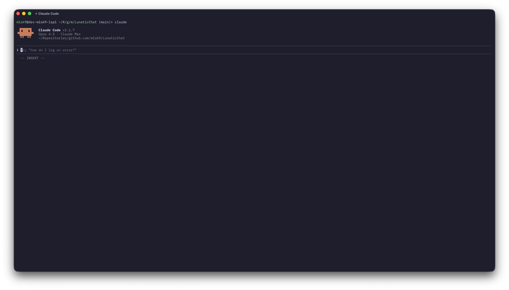
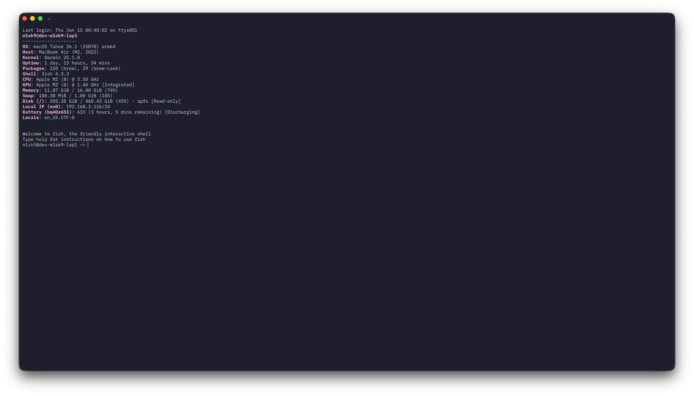
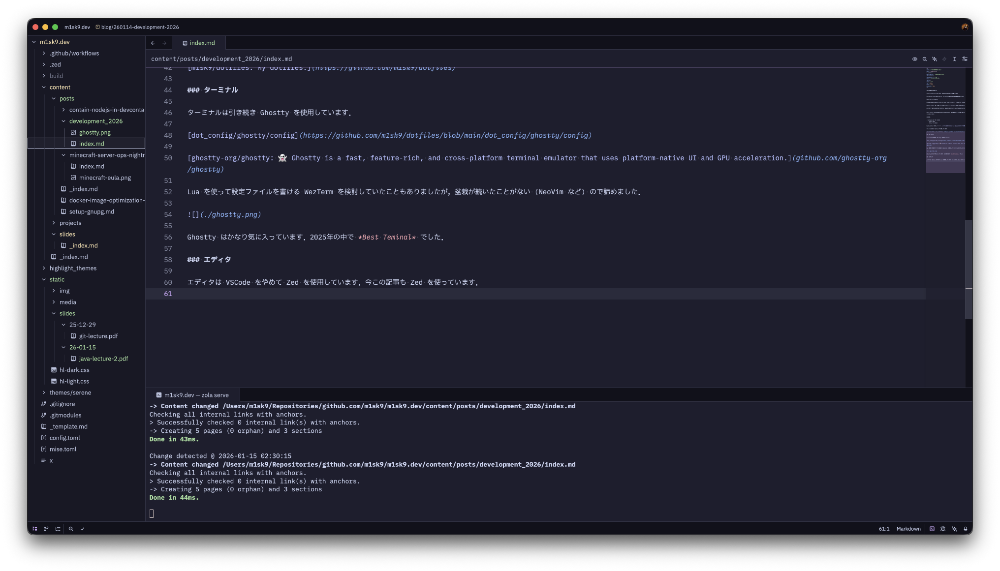
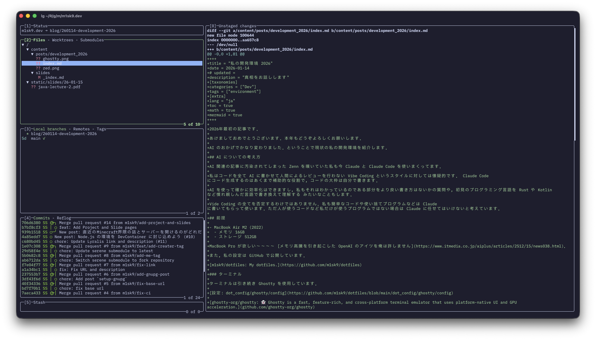
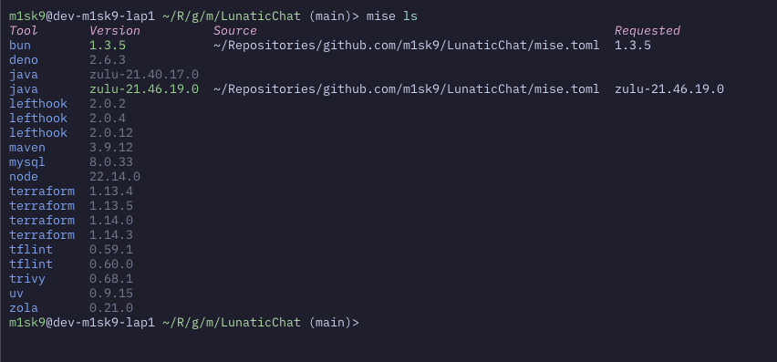

+++
title = "私の開発環境 2026"
date = 2026-01-14
# updated =
description = "真相をお話しします"
[taxonomies]
categories = ["Dev"]
tags = ["environment"]
[extra]
lang = "ja"
toc = true
math = true
mermaid = true
+++

2026年最初の記事です．

あけましておめでとうございます．本年もどうぞよろしくお願いします．

AI のおかげでかなり変わりました．ということで現状の私の開発環境を紹介します．

## AI についての考え方

AI 関連の記事に汚染されてしまった Zenn を嘆いていた私も今 Claude と Claude Code を使いまくってます．

私はコードを全て AI に書かせて人間によるレビューを行わない Vibe Coding というスタイルに対しては懐疑的です． Claude Code にコード生成するのはあくまで補助的な役割で，コードの大枠は自分で書きます．

AI を使って確かに効率化はできますし，私もそれはわかっているのである部分をより良い書き方はないかの質問や，初見のプログラミング言語を Rust や Kotlin など慣れ親しんだ言語で書き換えて理解する みたいなこともします．

Vide Coding の全てを否定するわけではありません．私も簡単なコードや使い捨てプログラムなどは Claude に書いてもらって使います．ただ人が使うコードなど私だけが使うプログラムではない場合は Claude に任せてはいけないと考えています．



## 前提

- MacBook Air M2 (2022)
  - メモリ 16GB
  - ストレージ 512GB

MacBook Pro が欲しい〜〜〜〜 [メモリ高騰を引き起こした OpenAI のアイツを俺は許しません](https://www.itmedia.co.jp/aiplus/articles/2512/15/news038.html)．

また，私の設定は GitHub で公開しています．

[m1sk9/dotfiles: My dotfiles.](https://github.com/m1sk9/dotfiles)

### ターミナル

ターミナルは引き続き Ghostty を使用しています．

[設定: dot_config/ghostty/config](https://github.com/m1sk9/dotfiles/blob/main/dot_config/ghostty/config)

[ghostty-org/ghostty: 👻 Ghostty is a fast, feature-rich, and cross-platform terminal emulator that uses platform-native UI and GPU acceleration.](github.com/ghostty-org/ghostty)

Lua を使って設定ファイルを書ける WezTerm を検討していたこともありましたが，盆栽が続いたことがない (NeoVim など) ので諦めました．

Ghostty はかなり気に入っています．2025年の中で *Best Teminal* でした．




### エディタ

エディタは VSCode をやめて Zed を使用しています．今この記事も Zed で書いています．

[設定: dot_config/zed/private_settings.json](https://github.com/m1sk9/dotfiles/blob/main/dot_config/zed/private_settings.json)

[zed-industries/zed: Code at the speed of thought – Zed is a high-performance, multiplayer code editor from the creators of Atom and Tree-sitter.](github.com/zed-industries/zed)

VSCode は Electron を使っているからかかなり起動がもっさりしている印象で，使っていてかなりストレスフルだった印象があるとやっぱり速度を求めている私はしんどい...

[DevContainer への対応は始まったばかり](https://zed.dev/blog/dev-containers)[^1] なのかかなり甘いので，完全移行にはなっていませんが，今年は Zed を使うことが多くなりそう． Claude Code にビルドイン対応しているのも大きいので．



### Git 関連

こちらは引き続き lazygit を使用しています．TUI での操作が一番楽になってしまった．

[設定: dot_config/jesseduffield/lazygit/config.yml](https://github.com/m1sk9/dotfiles/blob/main/dot_config/jesseduffield/lazygit/config.yml)

[jesseduffield/lazygit: simple terminal UI for git commands](https://github.com/jesseduffield/lazygit)

[カスタムコマンド](https://github.com/m1sk9/dotfiles/blob/0fa2c4901976bc9796eaead53ba4c05fac5b0dbd/dot_config/jesseduffield/lazygit/config.yml#L17-L32) を定義して，全ファイルを stash したり，commit を打ち消すコマンドを追加したりもしています．

```yml
customCommands:
  - key: "u"
    context: "files"
    description: "Stash unstaged files"
    command: "git stash save --include-untracked"
  - key: "r"
    context: "status"
    description: "Add remote url"
    command: 'git remote add origin "{{index .PromptResponses 0}}" '
    prompts:
      - type: "input"
        title: "remote url"
  - key: "<c-c>"
    context: "commits"
    description: "Cancel commit"
    command: "git reset --soft HEAD^"
```




### 開発環境

開発環境は次のように管理しています

- Rust: rustup を使って直接管理
- それ以外: [mise](https://github.com/jdx/mise) を使って管理

mise で管理している理由はまあ [Node.js と npm エコシステムの1件](../contain-nodejs-in-devcontainer) があったのもありますが，複数バージョンを管理する上で一番使いやすかったというのがあります．

asdf など世に出回ってる管理ツールを使ってきたが，mise に勝る点がなかったです．それぐらい優秀．



lefthook や terraform, tflint, trivy などもインストールできるのだいぶ強い．

[^1]: 今見ると1月7日公開だった... そりゃ甘いね
