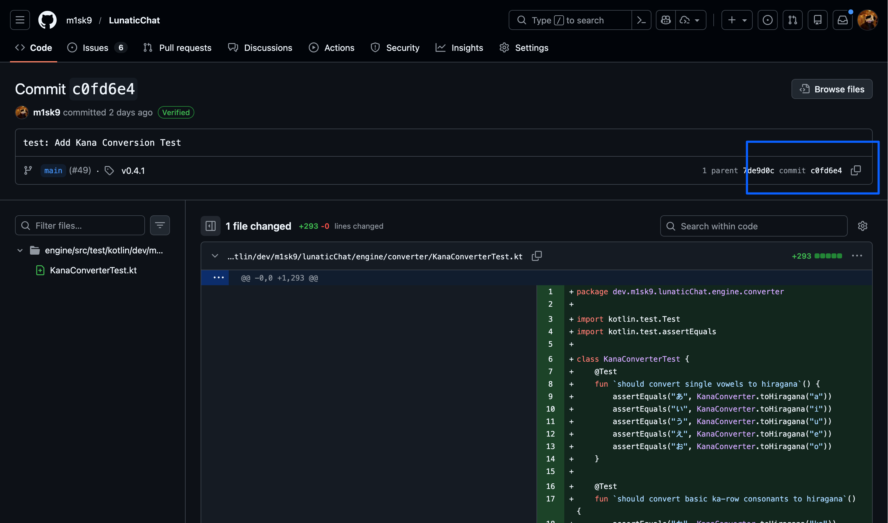

+++
title = "Git の cherry-pick について考える"
date = 2026-01-22
# updated =
description = "🍒"
[taxonomies]
categories = ["Dev"]
tags = ["git"]
[extra]
lang = "ja"
toc = true
math = false
mermaid = false
+++

Git には既存のコミットの内容を適用する cherry-pick という機能がある．
今日はこの機能について考えたいと思う．

```bash
git cherry-pick [--edit] [-n] [-m <parent-number>] [-s] [-x] [--ff]
		  [-S[<keyid>]] <commit>…​
git cherry-pick (--continue | --skip | --abort | --quit)
```

[Git - git-cherry-pick Documentation](https://git-scm.com/docs/git-cherry-pick)

## なんで cherry-pick っていうの?

元は英語の慣用句 「cherry-picking」 から来ているらしい．
慣用句としては「良いものだけを選んで取る」「いいとこ取りをする」という意味がある．

> the action or practice of choosing and taking only the most beneficial or profitable items, opportunities, etc., from what is available.
>
> "it is an exaggeration based on the cherry-picking of facts"

## 使い方

cherry-pick は，特定の commit を現在地点の branch へ適用するコマンドで，基本は引数に適用したい commit hash を選ぶだけ．

```bash
git cherry-pick <commit-hash>
```

commit hash は `git log` で確認するのもいいし， GitHub からでも確認できる．

(GUI 主義者はぜひ GitHub からコピーしよう．)

```bash
commit c0fd6e4c28967a66969cade0a212d7cee6d2728c

Author: Sho Sakuma <me@m1sk9.dev> Date: Tue Jan 20 20:37:02 2026 +0900 test: Add Kana Conversion Test
```



これが便利なシチュエーションとして

-  他の branch から特定の修正だけを取り込みたい
-  間違った branch に commit してしまった変更を正しい branch に移したいとき
-  Release branch に特定の hotfix だけを適用したいとき
	-  (でもこれは worktree で良くないか... というのは置いといて) [^1]

で役立つ．私もよく使う．

```bash
# 複数のコミットを順番に適用
git cherry-pick <commit1> <commit2> <commit3>

# コミット範囲を指定（commit1は含まれない）
git cherry-pick <commit1>..<commit2>

# コミット範囲を指定（commit1も含む）
git cherry-pick <commit1>^..<commit2>

# コミットせずにステージングエリアに追加
git cherry-pick --no-commit <commit-hash>

# コミットメッセージを編集
git cherry-pick --edit <commit-hash>
```

ただ，この cherry-pick を行うと新しい commit hash として扱われることから， conflict が発生する．これらを解決しないと merge が出来ないので注意が必要．

```bash
# コンフリクトを解決後
git cherry-pick --continue

# cherry-pick を中止
git cherry-pick --abort

# 現在の状態をスキップして次へ
git cherry-pick --skip
```

[^1]: worktree って分かりづらい機能だよなって思ってる
