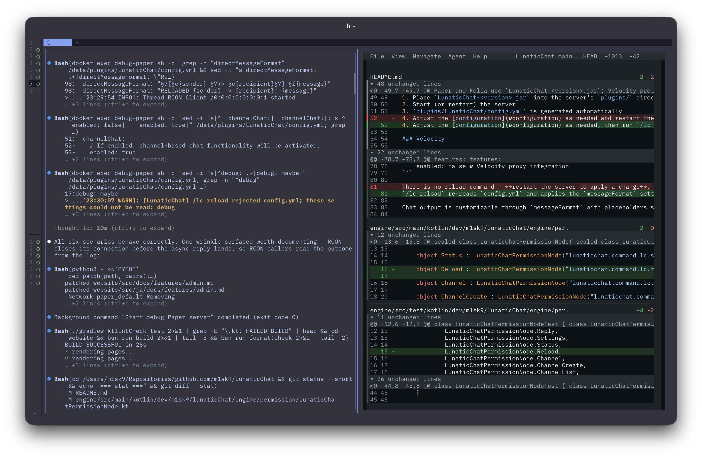

+++
title = "新しい Worktree に .env を引き継ぐ Herdr プラグインを作った"
date = 2026-08-12
# updated =
description = "Worktree の作成をフックして .env のコピーとセットアップコマンドの実行を行う Herdr プラグインと，その実装"
[taxonomies]
tags = ["ai", "herdr"]
[extra]
lang = "ja"
toc = true
math = true
mermaid = true
+++

最近はもっぱら [Herdr](https://herdr.dev/) を使い Claude Code とコーディングをしている．自分でコードを書くことはもう無くなった．



Herdr のいいところは Worktree[^1] を作成すると同時にブランチを切ることができ，そこで新しくセッションを作成することで，並列でコーディングを始めることができる．

だが，Worktree は作成 (checkout)すると，その時点のリポジトリをコピーするだけで `.gitignore` で Git 追跡外になっているファイルをコピーすることはない．すると，環境変数などを書き留めている `.env` などがコピーされないため，作成した Worktree 先で検証環境を立ち上げたいときに困る．[^2]

そこで Herdr プラグインとして，Worktree が作成されたときにこれらのファイルをコピーし，必要ならセットアップコマンドまで走らせるものを作ってみた．

[m1sk9/herdr-worktree-hooks-plugin - GitHub](https://github.com/m1sk9/herdr-worktree-hooks-plugin)

インストールは Herdr から．

```sh
herdr plugin install m1sk9/herdr-worktree-hooks-plugin
```

## 仕組み

Herdr プラグインは Herdr がイベント発火時に対象のバイナリをサブプロセスとして起動し，情報は環境変数経由で渡されるため，専用の API はない．


%%{init: {"flowchart": {"subGraphTitleMargin": {"top": 8, "bottom": 16}}} }%%
flowchart TB
  a["herdr（worktree 作成）"] --> b["環境変数付きでバイナリ起動"]
  b --> c
  subgraph plugin["プラグイン本体"]
    direction TB
    c["イベント payload から対象 worktree を特定<br>event.rs"]
    d["二重実行ガード（freshness + claim）<br>claim.rs"]
    e["ファイルコピー → コマンド実行<br>actions.rs"]
    c --> d --> e
  end


### イベントを購読する

プラグインの入口は `herdr-plugin.toml` というマニフェストで定義されていて，どのイベントでどのバイナリを起動するかを宣言している．

```toml 
[[events]]
on = "worktree.created"
command = ["target/release/herdr-worktree-hooks-plugin", "on-event"]

[[events]]
on = "workspace.created"
command = ["target/release/herdr-worktree-hooks-plugin", "on-event"]
```
[herdr-plugin.toml#L20-L26](https://github.com/m1sk9/herdr-worktree-hooks-plugin/blob/1b800e49ca6b5a9ec1098c895aabaaab4852b097/herdr-plugin.toml#L20-L26)


Worktree を作ると `worktree.created` と `workspace.created` というイベントが Herdr から発火される．これを受け取ったらバイナリを実行するように定義している．[^3]


### 対象の Worktree を特定する

先ほど受け取ったイベントの中身は `HERDR_PLUGIN_EVENT_JSON` という環境変数に JSON 文字列として渡ってくる．このブログのリポジトリで実際に Worktree を 1 つ作り，`worktree.created` で渡ってきたものがこれ（パスは短くしている）．

```json
{
  "event": "worktree_created",
  "data": {
    "type": "worktree_created",
    "workspace": {
      "workspace_id": "w2Y",
      "number": 10,
      "label": "docs-sample-payload",
      "focused": false,
      "pane_count": 1,
      "tab_count": 1,
      "active_tab_id": "w2Y:t1",
      "agent_status": "unknown",
      "worktree": {
        "repo_key": "/Users/m1sk9/src/m1sk9.dev/.git",
        "repo_name": "m1sk9.dev",
        "repo_root": "/Users/m1sk9/src/m1sk9.dev",
        "checkout_path": "/Users/m1sk9/worktrees/m1sk9.dev/docs-sample-payload",
        "is_linked_worktree": true
      }
    },
    "worktree": {
      "path": "/Users/m1sk9/worktrees/m1sk9.dev/docs-sample-payload",
      "branch": "docs/sample-payload",
      "is_bare": false,
      "is_detached": false,
      "is_prunable": false,
      "is_linked_worktree": true,
      "open_workspace_id": "w2Y",
      "label": "m1sk9.dev"
    }
  }
}
```

欲しいのは `data.workspace.worktree` の `repo_root`（コピー元）と `checkout_path`（コピー先）だが，同時に飛んでくる `workspace.created` にはこのうち `data.worktree` が無く，`workspace.focused` に至っては `workspace_id` しか入っていない．[^4]

また，`{event, data}` という封筒ごと渡されるのかどうかもドキュメント上は確定していないので，固定パスで引くのはやめて，「`repo_root` と `checkout_path` を両方持つオブジェクト」を JSON 全体から再帰的に探す実装にした．

payload にパスが含まれないイベントもある．その場合は `workspace_id` だけを拾って `herdr workspace get <id>` を叩き，返ってきた JSON に対して同じ探索をかける．冒頭に書いたとおり専用の API は無いが，CLI が JSON を返してくれるのでそれを API 代わりに使っている．

ここで `is_linked_worktree` が false なら，それは Worktree ではなく元のリポジトリ（main checkout）そのものなので，何もせず終了する．

### 二重実行を防ぐ

イベントを 2 つ購読している上に，既存の Worktree を開き直したときにも `workspace.created` は飛んでくる．放っておくと 1 つの Worktree にコピーとコマンドが 2 回走るので，2 段構えで止めている．

1 つめは checkout ディレクトリの作成時刻を見るチェックで，`worktree.created` 以外のイベントは既定 300 秒より古い checkout なら捨てる．

2 つめは claim で，こちらが本命．checkout path ごとのファイルを 1 つ作り，作成できたプロセスだけが処理を続ける．`create_new`（`O_EXCL`）で開いているので，自前のロックを持たなくてもファイルシステム側でレースが解決される．[^5]

```rust
match fs::OpenOptions::new()
    .write(true)
    .create_new(true)
    .open(self.path_for(checkout_path))
{
    Ok(mut file) => { /* 自分が担当 */ }
    Err(e) if e.kind() == io::ErrorKind::AlreadyExists => Ok(false),
    Err(e) => Err(e),
}
```
[claim.rs#L18-L32](https://github.com/m1sk9/herdr-worktree-hooks-plugin/blob/1b800e49ca6b5a9ec1098c895aabaaab4852b097/src/claim.rs#L18-L32)

失敗したときは claim を消すので，レースに負けたもう一方のイベントか次の作成で再試行される．また Herdr は起動時に前回の Worktree を復元するため，startup フックで既存の Worktree をすべて claim 済みにしておく．

### コピーとコマンドの実行

コピーは main checkout から Worktree への実ファイルコピーで，symlink は張らない．Worktree 側に同名のファイルがあれば触らない．新しい checkout に種を撒くのが目的であって，ローカルの編集を上書きするためではないからだ．[^6]

コマンドは Worktree を作業ディレクトリにしてシェルで実行し，`$MAIN` / `$WORKTREE` / `$REPO` / `$BRANCH` / `$EVENT` を環境変数として渡す．リポジトリに依存しないワンライナーで書けるようにするためだ．[^7]

### 設定

設定は `herdr plugin config-dir m1sk9.worktree-hooks` が出力するディレクトリの `config.toml` に置く．無ければ `.env` と `.env.local` がコピーされる．

```toml
[defaults]
copy = [".env", ".env.local"]

[repos.my-app]
copy = [".env.test", "config/secrets.yml"]
run = ["pnpm install --frozen-lockfile"]
```

`[repos.*]` のキーはリポジトリ名か main checkout の絶対パス．`copy` と `run` は `[defaults]` に追記される形でマージされ，`inherit = false` を書けば `[defaults]` を無視できる．`run` のシェルは `$SHELL`（無ければ `/bin/sh`）で，`config.toml` の `shell` で変えられる．


[^1]: [同じリポジトリに複数の作業ディレクトリを持つことができる機能](https://git-scm.com/docs/git-worktree)
[^2]: Claude (をはじめとする AI) は賢いので，Dummy として値を仮入れしてくれるが，流石にすべての環境で Dummy が成立するわけではない
[^3]: Herdr 0.8.0 でサイドバーの New Worktree を叩いて計測したところ，2つは同じミリ秒に発火していた．どちらが先に届くかは決まっていないようなので，両方購読した上で「先に来た方だけが処理する」ようにしている．
[^4]: イベントごとの payload の形は `herdr api schema --json` の `EventData` で確認できる．`workspace_created` は `workspace` だけ，`workspace_focused` は `workspace_id` だけを持つ．
[^5]: ファイル名は checkout path をサニタイズした文字列に FNV-1a のハッシュを付けている．サニタイズだけだと `/a/b` と `/a_b` が同じ名前に潰れて，別々の Worktree が互いの claim を奪い合ってしまうため．
[^6]: コピー対象は相対パスのみ受け付け，絶対パスや `..` を含むものは弾く．Herdr が作ったばかりの Worktree の外に書き込んでしまうため．
[^7]: `$BRANCH` だけは `git rev-parse --abbrev-ref HEAD` で checkout から読み直している．ブランチ名を持つのは `worktree.created` の payload だけで，どちらのイベントが claim を取るかはレースだから．
