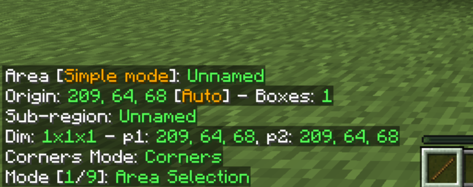
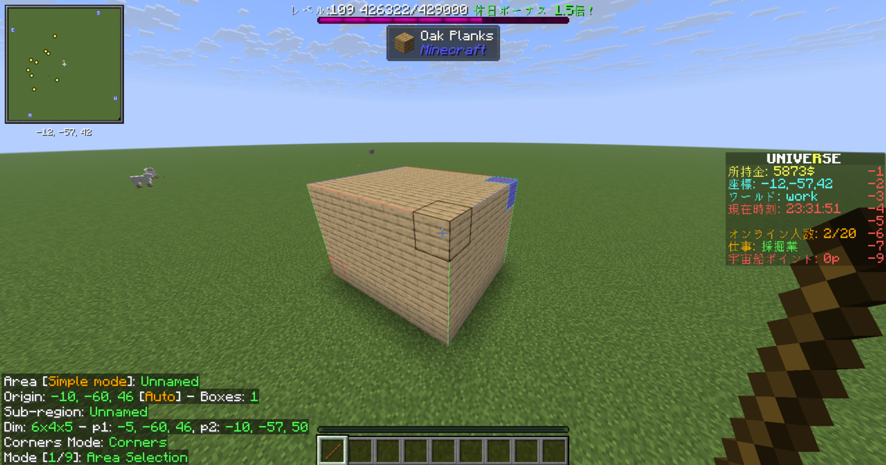
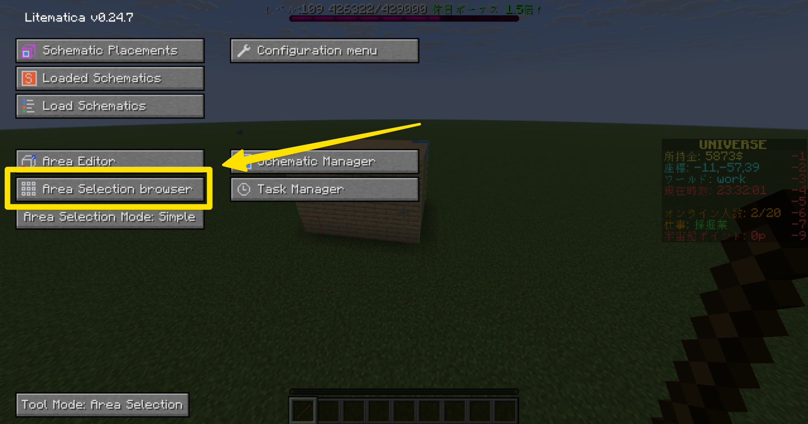
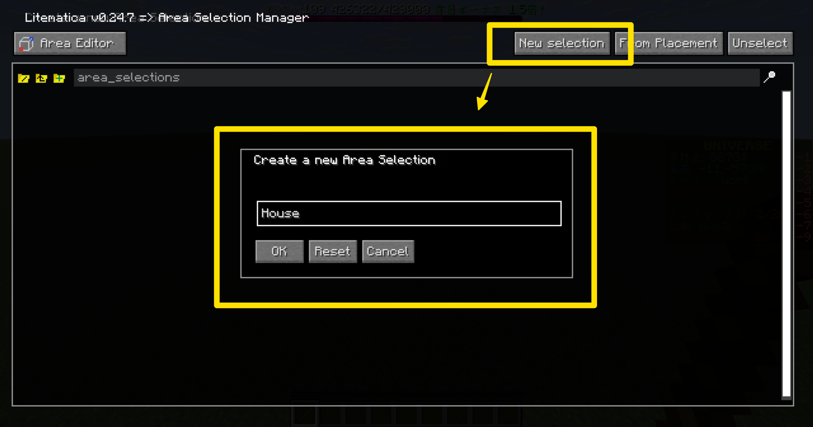
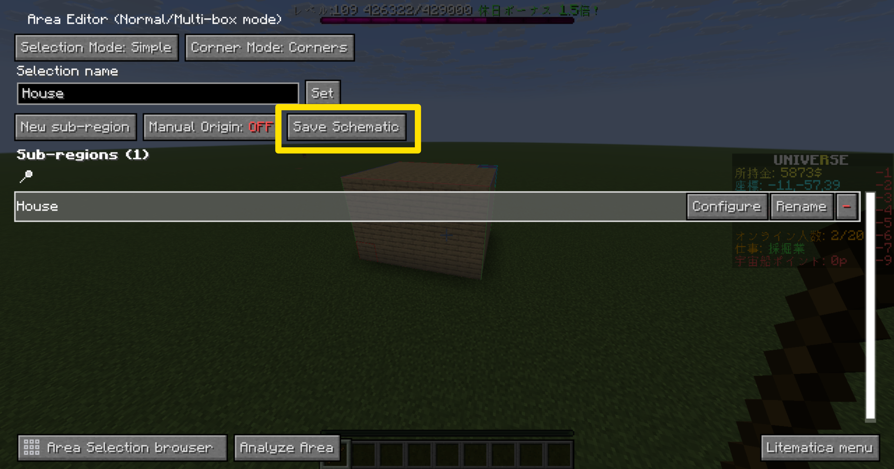
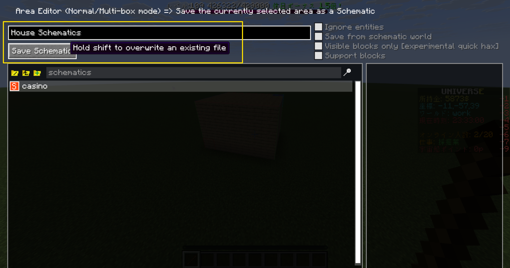
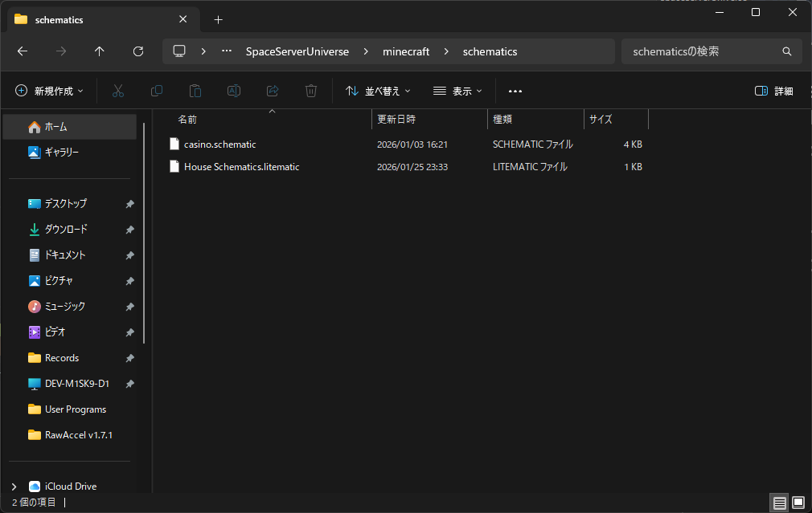

+++
title = "Litematica での設計図の作り方"
date = 2026-01-26
# updated =
description = "Litematica の設計図についてのプレイヤー向けガイド的なもの"
[taxonomies]
categories = ["minecraft"]
tags = ["dev", "litematica"]
[extra]
lang = "ja"
toc = true
math = true
mermaid = true
+++

Litematica の設計図についてのプレイヤー向けガイド的なもの

## Litematica の導入

Litematica は Mod なので各自で導入する必要があります．

[Litematica - Minecraft Mod - Modrinth](https://modrinth.com/mod/litematica)

- 対応バージョン: `1.12.x`, `1.13.2`, `1.14`, `1.14.2-1.14.4`, `1.15.x` ~ `1.19.x`, `1.20.1-1.20.4`, `1.20.6`, `1.21.x`
- 対象 Mod Loader: Fabric, Forge, LiteLoader, Ornithe, Rift

1.21.x の対応は Fabric のみなので，手元に Fabric の環境を作っておく必要があるので注意が必要 (LiteLoader ならまだしも Ornithe, Rift なんて使ってる奴おるんか？？？)[^1]

ここでは Fabric 環境の構築方法や Mod の導入は省略します．ネットに死ぬほど情報が転がってるのでそれを読んでね．

## 設計図とは

Litematica は `*.schematic` という形式の設計図ファイルを読み込み，建築物を透かしで表示して建築をサポートする Mod です．

今回のガイドはあくまで **設計図を作ること** なので， **設計図を使うこと** に関しては何も書きません．これもネットに死ぬほど情報が転がってるのでそれを読んでね．

## 設計図を取る

WorldEdit ではお馴染みの木の斧ですが， Litematica では木の棒を使う．

Litematica が導入された状態で木の棒を持つと左下に何か出てくると思う．

見るべきところは一番下の Mode．画像では **Area Selection** になっています．これはエリア選択のモードってこと．

もし違うモードになっていたら Alt を押しながらマウスホイールでスクロールすると切り替えられる．

### 建築物のエリアを選択する

まずは **Area Selection** に切り替えて建築物のエリアを選択する．

WorldEdit で編集するのと同じように建築物の対角線上に始点・終点でエリアを囲む．このときも囲み方も WorldEdit と同じ．右クリック・左クリックでそれぞれ始点・終点を選択します．

こんな感じ．

### エリアが選択しきれない場合

建築物がデカすぎてエリア選択がうまくいかない場合は建築物をぐるっと含められるように始点・終点にブロックをおいて，空気ブロック (Air) もまとめて選択してしまうしかないです．

設計図としては 空気ブロック (Air) は無視されるので大丈夫．

### 設計図を保存する

それでは設計図を保存しよう． Litematica のメニューを開く． (初期設定ではキーが多分バラバラなので，各自キー設定を見るように．)

いろんなのが出てくると思うが，まず **Area Selection browser** を選ぶ

そしたら **New selection** からエリアを登録する．

登録できたら登録したエリアの **Configure** を選ぶと出てくる Area Editor にある **Save Schematic** を選ぶ．

適当な名前をつけて保存する．

保存すると `.minecraft/` のフォルダーにある `schematics` フォルダーに先ほど作成した `*.litematic` ファイルがある．これが設計図になる．

## *.litematic と *.schematics の違い

`*.litematic` は Litematica 専用の設計図ファイルで，ブロック配置だけでなく，バージョン情報・材料リスト用データ・検証用データなど，Litematica機能向けのメタ情報が多く入っている．

それに対して `*.schematics` (`*.schematic`) は Litematica が流行る前に存在していた設計図 Mod である MCEdit や Schematica などで使われていた「古い共通フォーマット」で， Litematica でも読み込めるが，材料リストなどのデータが使えないという欠点がある．

基本は `*.litematic` で OK.

[^1]: 一部の Minecraft オタクしか知らんやろ
