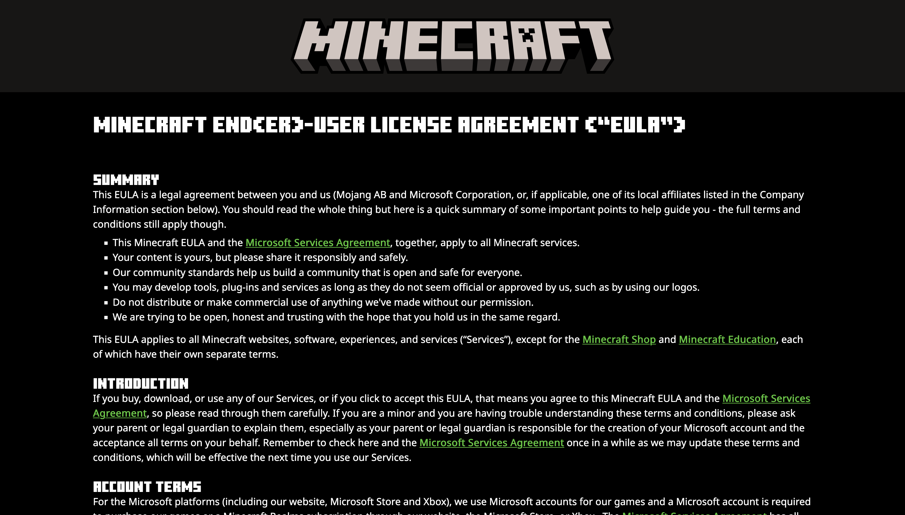

+++
title = "直近のMinecraft界隈の話とサーバーを開けるのがどれだけ大変か"
date = 2025-12-17
# updated =
description = "みんなが思ってるほど楽じゃないって話をしたい"
[taxonomies]
categories = ["Minecraft"]
tags = ["minecraft"]
[extra]
lang = "ja"
toc = true
math = true
mermaid = true
+++

[俺の友達が Minecraft サーバについてのブログを出していた](https://blog.yurisi.space/archives/10) ので，アンサーというかまあ直近の話でもしとこうかなと．

大前提として俺は某鯖の運営を7月くらいに退いていて，これからの話は **個人的な見解** として見てください．もうあの鯖とは関係持ってないからね．

## 最近の Minecraft サーバについて

さっき出したブログでも触れられていたように，最近はMinecraftのコミュニティがあまり活発ではないのは事実．

サーバリストも昔は **Japan Minecraft Servers** と **Monocraft** という2つのサービスで大いに賑わっていたんだけど，後者は半年前くらいにサービスが止まったまま動かずに放置されている．

自分が **サーバリストはすぐに死ぬもの** って言ってるのもこういうことなんだけど，基本的に Minecraft コミュニティは **個人の力** で賑わっているものが多いから資金繰りに失敗したり，モチベーションの維持に失敗してサービスを閉じざる負えなくなってしまう．

## 運営がいるのは当たり前じゃない

Minecraft サーバでお金を稼ぐことは難しいから，基本的に Minecraft サーバの運営は全員無休のボランティアとして働いている．お金をもらっているわけではない．

そしてその運営も各サーバのオーナーが信頼をおける人間じゃないといけないから，すぐに**増員したりもできない**．だって誰もお金がもらえないのに無休で働いてほしいって言われて働くわけないでしょ? ね?

### Minecraft の資金繰りの大変さ

ブログでも触れられていたお金の話をしたいと思う．

> 皆様に満足していただけるものにするには費用がかかりすぎた

**Minecraft のマルチサーバは本当にお金がかかります．マジで．**

先ほどの記事では大雑把だったが，実際に今から立てようとすると，[サーバ代: 12000円](https://www.vultr.com/pricing/#cloud-compute)，[DDoS (サーバへの攻撃) への防衛: 4000円](https://tcpshield.com/plans)

その他もろもろで月額3万円が必要になる．それを学生などが持つと考えるとどうだろうか．バイト代の半分も無くなってしまう．参考程度に某鯖のお財布事情でも見てみればいい．自宅サーバでもちゃんとかかる．

[seichi click networkのお財布事情とか](https://www.seichi.network/post/seichi-click-networkのお財布事情とか)

実際運営している間もプレイヤーから「じゃあソシャゲみたいに課金要素追加すればいいじゃん」とか「法人化すればいいじゃん」とかめちゃくちゃ言われたけど **出来ない**．

ここで立ちはだかってくるのが Minecraft EULA というものの存在．

[Minecraft End(er)-User License Agreement (“EULA”)](https://www.minecraft.net/en-us/eula)

    はい今嫌な顔したそこの Minecraft 関係者

まあようは利用規約みたいなものなんだけど，この EULA の中には ([Minecraft Usage Guidelines](https://www.minecraft.net/en-us/usage-guidelines)) Minecraft を使って商標活動(平たく言えば金稼ぎ)をする上でのガイドラインが書いてある．

> Selling entitlements that affect gameplay provided they don’t ruin other players’ experience or give a competitive advantage in the game
>
> (ゲームプレイに影響を与える特典を販売してよいが、他プレイヤーの体験を台無しにしたり、ゲーム内で競争上の優位性を与えてはならない)

このようにソシャゲのような課金要素を明確に禁止と言われている以上 **マルチサーバで資金を確保するのが難しい** のである．(過去に俺にそういう文句を言ってきた人はこれを見て学んでください)

<iframe width="560" height="315" src="https://www.youtube-nocookie.com/embed/vba04dugWms?si=Op3HghmqGDaLFZFv" title="YouTube video player" frameborder="0" allow="accelerometer; autoplay; clipboard-write; encrypted-media; gyroscope; picture-in-picture; web-share" referrerpolicy="strict-origin-when-cross-origin" allowfullscreen></iframe>

## それでも (俺が) サーバを開こうとする理由 / 運営活動をしていた理由

**楽しいから**

今自分がエンジニアとして会社で働いているのも，大学生として情報工学(平たく言えばプログラミング)を学んでいるのも元はと言えば Minecraft のおかげなので，それなりに感謝している．

Minecraft は無限大なのでなんでもできる．だからこそ資金繰りが大変でもめちゃくちゃ文句言われてもなんとかモチベーションを保てている．(何回かやめようと思ったり，フレンドに愚痴ったりしたけど)

だから今もどっかのタイミングでサーバを開こうとしてるし，運営活動をしていたのが理由の一つです．

これが今言いたいことの全て! 以上です．

## おまけ: 新宇宙鯖 (SpaceServerUniverse) のこと

開発停止理由が公の場 (ブログで触れられていた) に出たので，ちょっと詳しい解説を加えようと思います．ここからはちょっと深い話になるので読みたい人だけ読んでください．

> オリジナルのワールド生成が出来ない…

> 技術的には可能だとは思うのですが、調べてもそのような文献が余り出てこないだけでなくコードを読むとMinecraftのワールドのアルゴリズムを理解していないと出来なさそうでした。厳しい。

リソースパック，データパックへの知見がある人は多分 **簡単じゃん** と思うだろうが， Bukkit (Spigot/Paper) だとちょっと話が変わってくる．

2021年6月8日/11月30日にリリースされた Minecraft 1.17, 1.18 (洞窟と崖) ではワールド生成のアルゴリズムに変更が加わったので，過去の人間が開発していたカスタムワールド系のプラグインは全滅してしまった．現状の最新バージョン 1.21.10 でのアルゴリズムに関しては解明できていない．

[Java Edition 1.18 # 洞窟](https://ja.minecraft.wiki/w/Java_Edition_1.18#%E3%83%AF%E3%83%BC%E3%83%AB%E3%83%89%E7%94%9F%E6%88%90)

> 洞窟
>   - 完全に作り変えられた。
>   - Y=-59まで伸びるようになった

開発中に原因が突き止めればよかった．申し訳ないと思っているのでどっかのタイミングでこの原因を解明したいと思う．ちょっと待っててね．
