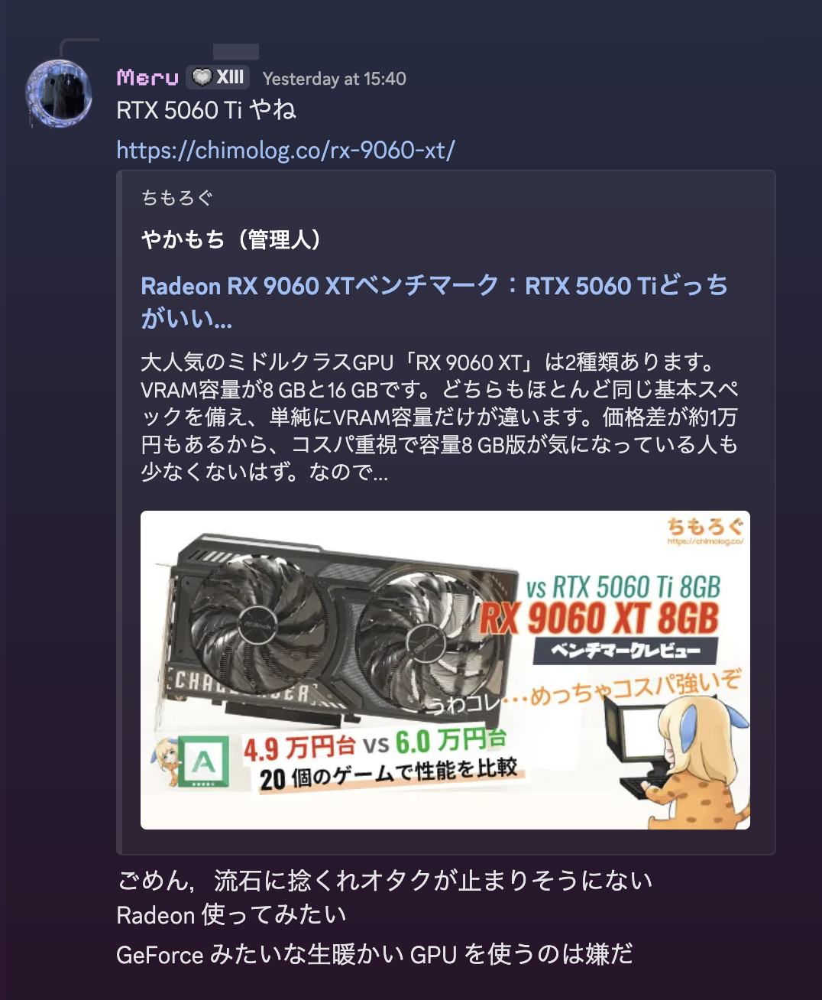

+++
title = "新しい自作PCを組み立てる2026"
date = 2026-01-01
# updated =
description = "産業廃棄物「GTX 1660 Super」からついに解放"
[taxonomies]
categories = ["Life"]
tags = ["pc"]
[extra]
lang = "ja"
toc = true
math = true
mermaid = true
+++

新しい PC を組み立てます．

最後に組み立てたのは2021年の頃だったので，約5年ぶり．

## きっかけ

きっかけはやっぱり GPU で，今使ってるのは GTX 1660 Super． 2021年 マイニング需要の高まりで GPU の価格が高騰していたせいで，最大限のコスパを求めた結果，この GPU を選びました．

当時は別に遊びたいゲームもそこまで重量級ではなかったので，これで十分だろうと思っていたんですが，もう今は色々と限界が来たので，ついに新しい PC を組み立てることにしました．

この 1660 Super でなぜか動いて DLC までクリアした Cyberpank2077 は5周年を迎えました．祝ってね．

<iframe width="560" height="315" src="https://www.youtube-nocookie.com/embed/oVHAHRHMrpo?si=S1OqI4r1Mf7vRFTr" title="YouTube video player" frameborder="0" allow="accelerometer; autoplay; clipboard-write; encrypted-media; gyroscope; picture-in-picture; web-share" referrerpolicy="strict-origin-when-cross-origin" allowfullscreen></iframe>

## 構成を考える

2021年と比べて，自作PC界隈の常識は大きく変わっているようでして

- メモリは 16GB じゃもう足りないので 32GB が必須級になっている
- VRAM は積めるだけ積めろ (8GB じゃなくて 16GB)

...

    俺の常識が効かない

それを踏まえて，[以下のような構成](https://zisalog.com/tool/?struct_id=IzwESTUT33nx)を考えました．

- CPU: AMD Ryzen 7 5700X
- CPUクーラー: DEEPCOOL AK400 R-AK400-BKNNMN-G-1
- メモリ: Corsair CMK32GX4M2Z3600C18 32GB (16GBx2)
- マザーボード: ASUS TUF GAMING B550-PLUS
- GPU: 玄人志向 RD-RX9060XT-E16GB/DF

捻くれオタクが止まりそうになく，GeForce という安全側に倒すことはせず，AMD Radeon RX 9600 XT を選びました．**気になるんや**

特にやりたいゲームが決まっているわけでもないので，とりあえずミドルスペックで揃えようとしています．まあだから 2021年 と考え方は同じ．
