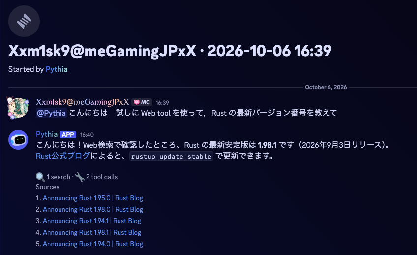

+++
title = "Pythia"
description = "Pythia"
template = "prose.html"
insert_anchor_links = "right"

[extra]
lang = "ja"
title = "Pythia の使い方"
subtitle = ""

copy = true
reaction = false
comment = false
+++

このページで扱っている Pythia は @m1sk9 の Discord サーバー「me」で運用しているビルドです．

限界開発鯖メンバー向けの TL;DR

- この Bot は ichiyoAI の後継Bot です.
- 限界税(のようなもの)は取っていません．サーバー費・クレジット全て m1sk9 持ちです．
  - [寄付はいつでも受付中です](https://github.com/sponsors/m1sk9)
- モデルは全て固定になりました．スラッシュコマンドで自由にコントロールはできません．
  - 誰のリクエストもすべて一つのモデルで処理されます．
- 画像生成はできません．

[m1sk9/Pythia: A Discord bot that bridges your server and LLM APIs. - GitHub](https://github.com/m1sk9/Pythia)

----

**注意:** 現在試験運用中です．予告なく仕様が変更されたりサービスが停止する可能性があります．

# 使い方

- `@Pythia` とメンションをつけてメッセージを送信するだけです．
  - メッセージを送信するとその場にスレッドを作成します．
  - スレッドの内では Pythia とシームレスに会話でき，スレッド内ではコンテキストが維持されます (つまり会話内容を覚えてくれます)
    - スレッド内でメンションは必要ありません．
- 作成者ではなくてもそのスレッドに参加することができ， Pythia と会話することができます．
- Pythia が生成したスレッドではない **ユーザーや Bot が作成したスレッド** でもメンションすれば会話できます．

# モデル

- [`openai/gpt-6-luna:floor`](https://openrouter.ai/openai/gpt-6-luna) を使用しています (`2026/10/06〜`)
  - **Modalities**: File / Image / Text → Text
  - **In / Out Price**: $0.10 / $0.50per 1M
  - **Context**: 1.1M

- 参考情報:
  - [Introducing GPT‑6 Sol and Luna - OpenAI](https://openai.com/index/introducing-gpt-6-sol-and-luna/)
  - [OpenAI: GPT-6 Luna Benchmarks - OpenRouter](https://openrouter.ai/openai/gpt-6-luna#benchmarks)

# 設定

- 運用状況に伴い設定を都度変更しています．
- 最新設定は [m1sk9/infra@ansible/roles/docker_compose_app/files/pythia/config.toml](https://github.com/m1sk9/infra/blob/main/ansible/roles/docker_compose_app/files/pythia/config.toml) を参照してください．

## システムプロンプト

[m1sk9/infra@ansible/roles/docker_compose_app/files/pythia/system_prompt.md](https://github.com/m1sk9/infra/blob/main/ansible/roles/docker_compose_app/files/pythia/system_prompt.md)

## ガードレール設定

OpenRouter に設定しているガードレールを下に示します．これはモデルと me メンバーを守るために設定しています．

ガードレールについては [こちら](https://openrouter.ai/docs/guides/features/guardrails) を参照してください．

Pythia は @m1sk9 が設定したガードレール `me-org-guardrail` に準拠して動作します．

### Budget Policies

- 月に `$10` までのリクエストが使用できます (モデル・`web_seatch`ツール含め)
  - こちらは使用状況により変更する予定です．

### Model & Provider Access

- **Zero Data Retention (ZDR):** 有効 (全てのモデル)
  - モデル利用時に Anthropic, OpenAI, Google, SpaceXAI のプロバイダは使用しません．
  - そのため，全てのリクエストは学習に利用されません．
- **Data Training:** 無効 (全てのモデル)
  - 有料・無料モデル関係なく，全てのリクエストは学習に利用されません．
  - ただし必ずの保証はありません．機密情報は送らないようにしてください．
- **Access Policy:** 無効
  - ZDR，Data Training を優先します．
- **Prompt Injection:** 有効
  - プロンプトインジェクションの疑いがあるレスポンスを受け取った際は即座に処理が停止されます．

### Sensitive Info Detection

- 全て有効にしています．
  - メールアドレスや氏名，住所などはモデルに送信される際に伏せ字になります．
  - こちらも必ずの保証はありません．機密情報は送らないようにしてください．
- この設定で守られる情報は次の通りです．
  - メールアドレス
  - 電話番号
  - 社会保障番号
  - クレジットカード番号
  - IPアドレス
  - API キーなどのシークレット
  - 氏名
  - 住所

# 使用できるツール

Pythia v3.1.0 時点では以下のツールが使用できます．

- `web_search`: Web検索を行うツール
  - [Parallel](https://parallel.ai/products/search) を使用します (ホストは OpenRouter)
- `web_fetch`: Webページを取得するツール
  - OpenRouter 内臓を使用します
- `datetime`: 現在時刻を取得するツール
  - OpenRouter 内臓を使用します

# 出来ること・出来ないこと

今までの話を聞いて分からない人向けにできること・できないことをまとめます．

- 🙆 **出来ること**:
  - 会話
  - 画像を理解すること (OCR を含む)
    - PNG / JPEG / WebP / GIF に対応しています．直近 5 件の発言に添付された画像のうち，新しいものから最大 4 枚を読みます．1 枚 5 MB までです
  - Web 検索・Web ページの読み取り
  - 現在日時の把握
- 🙅 **出来ないこと**:
  - ファイル生成
    - 画像生成もできません
  - PDF・テキストファイルなど，画像以外の添付ファイルを読むこと
    - ファイル名は見えますが，中身は読めません
  - 記憶
    - メモリ機能はありません．あなたのことを覚えることはできません
    - 別のスレッドの会話も覚えていません．長いスレッドでは，古い発言から順に忘れていきます
  - サーバーについて知ること
    - スレッドの外にあるチャンネルやメッセージは見えません
  - Discord 上の操作
    - ロールの付与やメッセージの削除などはできません
  - プログラミング
    - コードの生成はできます．Claude Code などのように自律的な開発はできません
    - コードを実行することもできません

# 使用ルール

- Pythia は @m1sk9 の趣味プロジェクトです．予告なく仕様が変更されたりサービスが停止する可能性があります．
  - そして全て実費でやっています．エージェント目的などで使うのは自分のお金でやってください．
- LLM の安全性を損なう使い方や人間など第三者に危害を加えるような使い方はしないでください．
  - それらの使い方を確認できた場合はサーバから追放する可能性があります．
- 機密情報など **見られたら困る情報** は送らないでください．
  - ある程度 OpenRouter が止めてくれますが，絶対ではありません (特に日本語の場合保証できない)
- Pythia で受けた損害に対して @m1sk9 は一切責任を負いません．
  - この鯖は **20歳以上のみ** の参加を認めています．自分で責任を取れる年齢だと思っています．
- 困ったことがあったら @m1sk9 に連絡してください．
  - 鯖内で連絡するのが憚れる場合は DM か `me@m1sk9.dev` にメールを送ってください．
